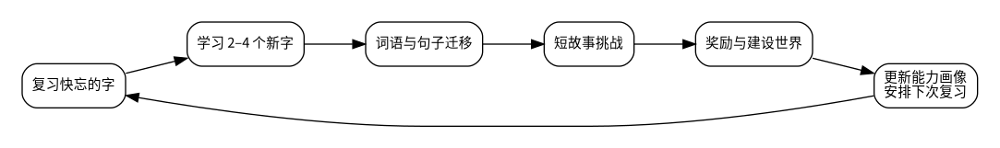
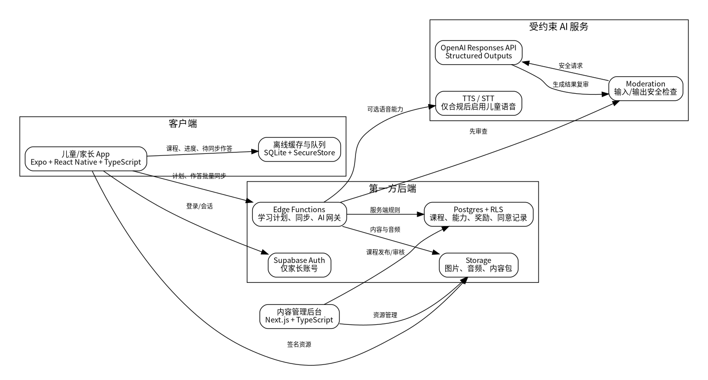

# HanziQuest（汉字探险）完整产品与技术设计文档

**文档版本：** 1.0  
**状态：** 可实施基线（Implementation Baseline）  
**目标读者：** 创始人、产品经理、课程设计师、UI/UX 设计师、移动端与后端开发者、测试人员、Codex  
**工作名称：** HanziQuest / 汉字探险（正式品牌名待定）

> 本文档是面向代码实现的产品需求文档（PRD）与技术设计文档（TDD）的合并版本。配套文件包括 `AGENTS.md`、`CODEX_IMPLEMENTATION_PLAN.md`、`supabase_schema.sql` 和 `AI_CONTENT_CONTRACTS.ts`。

## 0. 默认假设与关键决策

在没有进一步业务限制的情况下，本版本采用以下默认值：

| 项目 | 默认决策 |
|---|---|
| 核心用户 | 6–10 岁、在海外长大、会听会说普通话但识字量低的华裔儿童 |
| 购买与管理者 | 家长或法定监护人 |
| 首发平台 | iOS 与 Android；管理后台为 Web |
| 首发语言 | 儿童学习内容为普通话；家长界面支持中文与英文 |
| 首发字形 | 简体中文；数据结构从第一天支持繁体映射 |
| 每日学习时长 | 默认 8 分钟；家长可设 5、8、10 或 15 分钟 |
| MVP 内容量 | 120 个核心汉字、约 250 个词、80 个句子、20 个短故事、4 个主题世界 |
| 登录模式 | 仅家长建立账号；儿童不使用邮箱、手机号或社交账号 |
| AI 原则 | 学习引擎决定“学什么与多难”；生成式 AI 只在明确约束下生成内容 |
| 儿童开放聊天 | MVP 不提供 |
| 商业模式 | 无广告；后续采用家长门后的订阅或一次性课程包 |

如市场研究确认主要用户为繁体字家庭、粤语家庭或 10 岁以上儿童，应新增课程轨道，而不是把同一轨道中的音频、字形和难度混在一起。

# 1. 执行摘要

## 1.1 产品一句话定位

**把海外华裔儿童已经会说的中文，转化为能认、能读、能理解的汉字阅读能力。**

## 1.2 用户问题

目标儿童通常存在明显的“口语能力与阅读能力断层”：

- 能理解并说出“我要喝水”“小猫在桌子下面”等日常中文。
- 看见“喝、水、桌、下”等汉字时无法识别。
- 传统对外汉语课程从基础口语开始，内容过于简单。
- 国内语文课程默认已有识字和拼音基础，进度过快。
- 单纯闪卡和抄写缺少语境，短期能记住，长期容易遗忘。
- 家长知道孩子需要学，但难以每天设计内容、监督和判断真实进步。

## 1.3 产品解法

产品使用儿童已有的中文听说能力，构建以下学习链路：

**声音 → 意思 → 汉字 → 词语 → 句子 → 故事阅读 → 真实任务**

每次学习由一个确定性的自适应学习引擎规划，控制在 5–10 分钟，包含复习、新字、词句迁移、短阅读和奖励。儿童通过闯关建设自己的世界；家长通过简明报告看到真实识字与阅读进步。



## 1.4 核心差异化

1. **不重新教孩子已经会说的内容。** 主要利用声音和熟悉语境建立字形连接。
2. **能力按技能维度记录。** “听音能选字”和“看字能读出”不是同一个能力。
3. **关卡不是固定题单。** 同一关根据儿童掌握度动态选择题目、提示和新字数量。
4. **奖励服务于学习。** 解锁的角色、房间、宠物和地图与学过的汉字和故事关联。
5. **AI 受课程系统约束。** AI 不能随意决定课程，也不能直接把未经验证的内容展示给儿童。
6. **家长控制、儿童最小化数据。** 不依赖广告、开放社交或儿童个人账号。

# 2. 产品愿景、目标与非目标

## 2.1 产品愿景

让海外长大的华裔儿童在不把中文学习变成家庭冲突的情况下，逐步获得独立阅读中文故事、家庭消息、菜单、节日内容和日常文本的能力，并建立与家庭语言和文化的长期连接。

## 2.2 产品目标

### 学习目标

- 儿童能够把熟悉的口语词汇与汉字建立稳定联系。
- 儿童能够从单字识别迁移到词语、句子和短故事阅读。
- 系统能识别遗忘、混淆和提示依赖，并自动安排复习。
- “掌握”必须代表跨时间、跨题型的稳定表现，而不是一次答对。

### 使用目标

- 单次学习足够短，儿童可以独立完成。
- 每周完成 4 天即可形成成功感，不要求完美连续打卡。
- 每次学习结束时都产生可见进度与适度奖励。
- 家长每周用不超过 1 分钟理解孩子的进度和下一步建议。

### 商业目标

- 免费体验必须能证明产品确实帮助孩子开始识字。
- 付费价值来自系统课程、个性化计划、故事和多儿童管理，而不是广告或随机付费奖励。
- 产品架构能逐步支持繁体、粤语、更高年龄段和学校/机构版。

## 2.3 非目标

MVP 明确不做：

- 完整的中文口语入门课程。
- 以书法或大量手写为主的课程。
- 面向儿童的开放式 AI 聊天。
- 儿童社交、排行榜、陌生人互动或用户生成内容广场。
- 广告、抽卡付费、无限刷奖励或刺激性连续签到惩罚。
- 一开始覆盖所有年龄、方言、字形和国家课程标准。
- 让大语言模型直接决定课程顺序、掌握度或奖励发放。

# 3. 目标用户与角色模型

## 3.1 核心儿童画像

### 画像 A：会说但不识字

- 年龄：6–8 岁。
- 在家和父母或祖父母使用中文。
- 能理解大量日常口语，但识字量少于 50。
- 英文或居住国语言阅读能力正常。
- 喜欢图像、故事、宠物和装扮奖励。
- 容易因为“中文太难”或“像上课”而拒绝学习。

### 画像 B：认识一些字但阅读断裂

- 年龄：8–10 岁。
- 认识约 50–200 个字，但主要依赖记忆和猜测。
- 能读短词，无法连续阅读句子。
- 对幼儿化内容反感，更喜欢冒险、体育、科学、游戏和神话。
- 需要更少图片提示和更快的进阶节奏。

### 画像 C：口语不均衡的兄弟姐妹

- 同一家庭有多个儿童，年龄和口语水平不同。
- 家长希望使用同一订阅和设备，但每个儿童有独立进度。
- 需要儿童档案切换和家长 PIN，不能互相覆盖学习数据。

## 3.2 家长画像

家长通常：

- 希望孩子保持中文，但时间有限。
- 不确定应该教哪些字、何时复习或如何判断掌握。
- 不希望每天监督整节课。
- 关心屏幕时间、隐私、安全和是否真的有效。
- 希望看到“本周掌握了什么、哪里困难、在家怎么练”，而不是复杂图表。

## 3.3 系统角色

| 角色 | 权限 |
|---|---|
| 家长所有者 | 创建家庭、管理订阅、同意条款、创建/删除儿童档案、查看全部报告 |
| 家庭家长成员 | 经邀请后查看和管理被授权的儿童档案 |
| 儿童档案 | 无独立登录凭证；只能进入儿童学习区 |
| 课程编辑 | 创建、校验和发布课程内容；不能查看儿童身份数据 |
| 支持人员 | 受审计地处理账号问题；默认无权查看儿童学习明细 |
| 系统服务 | 执行学习计划、奖励、同步、AI 生成和报告任务 |

# 4. 成功指标与产品护栏

## 4.1 北极星指标

**每个活跃儿童每 28 天新增的“稳定掌握汉字数”。**

“稳定掌握”定义见第 11 章，至少要求：

- 在不同日期出现过；
- 跨至少两种题型答对；
- 在无完整提示的情况下检索成功；
- 延迟复习后仍保持目标正确率。

## 4.2 学习效果指标

- 28 天稳定掌握汉字数。
- 独立读懂句子的比例。
- 故事理解题正确率。
- 提示依赖率变化。
- 相似字混淆率变化。
- 延迟 7 天与 30 天后的保留率。
- 朗读中漏字、替换字和长停顿的变化（语音功能上线后）。

## 4.3 参与指标

- 每周学习天数中位数。
- 每日计划完成率。
- 关卡中途退出率。
- 奖励领取后继续无限使用的比例应受到控制，而不是越高越好。
- D1、D7、D30 留存按年龄和初始水平分层观察。

## 4.4 家长价值指标

- 家长周报打开率。
- 家长能否正确理解孩子当前水平的调研结果。
- 订阅转化与续订。
- 数据导出、删除和支持请求的处理成功率。

## 4.5 护栏指标

- 每日儿童端使用时长中位数和 95 分位数。
- 关卡连续失败次数。
- 因断签导致的流失率。
- AI 内容验证失败率和儿童可见安全事件数。
- 儿童个人数据或语音被发送到第三方服务的次数必须可审计并符合配置。
- 任何付费入口都必须位于家长门后。

# 5. 产品设计原则

1. **先利用会说的，再教不会读的。** 默认以音频和熟悉句子引入汉字，不依赖英文翻译。
2. **短而完整。** 每关 5–8 分钟，有开始、挑战、成功和结束，不产生无限任务流。
3. **成功率保持在挑战区。** 目标答对概率约 75%–90%，默认中心为 82%。
4. **错误是教学信号，不是惩罚。** 错误触发脚手架、降提示难度和复习，不扣掉已有奖励。
5. **结尾必须成功。** 每节最后一个活动应是儿童大概率能完成的迁移或故事任务。
6. **奖励体现真实成长。** 等级与掌握字数、阅读故事和延迟复习表现关联。
7. **儿童不为平台创造内容。** MVP 不需要自由输入个人故事、公开昵称或上传照片。
8. **AI 可替换、可验证、可关闭。** 没有 AI 服务时，核心课程仍可正常运行。
9. **家长是同意主体。** 儿童区与设置、购买、外链和隐私操作之间必须有家长门。
10. **隐私最小化优先于数据便利。** 能不采集的数据不采集，能本地处理的儿童语音优先本地处理。

# 6. 产品信息架构与页面地图

## 6.1 顶层结构

应用包含两个明显分离的区域：

### 儿童学习区

- 儿童档案选择
- 今日任务 / 世界地图
- 关卡播放器
- 故事阅读器
- 奖励揭晓
- 我的房间 / 宠物 / 收藏
- 成就与已掌握汉字册

### 家长区

- 家长登录与家庭设置
- 儿童档案与课程轨道
- 学习报告
- 每日目标与提醒
- 订阅与购买
- 隐私、同意、导出与删除
- 帮助与反馈

儿童从学习区进入家长区时，必须通过一个不适合低龄儿童直接完成的家长门，例如长按后完成一道成人阅读题或输入家长 PIN。单纯的“3 秒长按”不能作为付费和隐私操作的唯一防线。

## 6.2 页面路由建议

```text
app/
├── (public)/
│   ├── welcome
│   ├── sign-in
│   └── legal
├── (parent)/
│   ├── dashboard
│   ├── children
│   │   ├── new
│   │   └── [childId]
│   ├── reports/[childId]
│   ├── subscription
│   ├── privacy
│   └── settings
├── (child)/
│   ├── profiles
│   ├── home/[childId]
│   ├── lesson/[sessionId]
│   ├── story/[storyId]
│   ├── rewards/[childId]
│   ├── collection/[childId]
│   └── achievements/[childId]
└── modal/
    ├── parent-gate
    ├── hint
    ├── reward-reveal
    └── offline-status
```

## 6.3 导航原则

- 儿童区优先采用图标、角色语音和少量汉字，不依赖长段说明。
- 关卡中不显示传统底部导航，防止误触退出。
- 退出关卡前弹出简短确认，并自动保存已完成活动。
- 家长区使用标准可访问导航，允许返回、深链和 Web 展示。
- 儿童区不显示外部链接、隐私政策、客服邮件或商店入口。

# 7. 核心用户旅程

## 7.1 首次使用：家长建立家庭

1. 家长打开应用，看到产品价值、年龄范围和隐私摘要。
2. 家长使用邮箱、Apple 或 Google 登录。
3. 家长选择国家/地区、界面语言和时区。
4. 家长阅读并记录当前版本的服务条款、隐私政策与儿童数据同意。
5. 家长创建儿童档案：昵称、年龄段、普通话口语自评、简/繁体偏好、兴趣主题。
6. 应用明确说明儿童无需邮箱、电话号码或真实全名。
7. 家长选择每日目标和每周目标，默认每天 8 分钟、每周 4 天。
8. 儿童进入诊断关卡。

### 验收标准

- 未完成必要同意前不能创建儿童档案。
- 仅保存年龄段或出生年份，不要求精确生日。
- 昵称可以是非真实名字；支持只存设备本地的显示昵称选项。
- 创建流程可中断并恢复。
- 家长能够查看、撤回同意并发起删除。

## 7.2 初始诊断

诊断目标不是给儿童贴“零基础/高级”标签，而是估计每个能力维度的起点。

### 诊断组成

- 听音选图：确认口语词汇是否熟悉。
- 听音选字：估计声音到字形连接。
- 看字选图：估计字义识别。
- 看字选读音：估计字形到语音连接。
- 词语与短句阅读：估计迁移能力。
- 相似字区分：只在前面表现允许时出现。

### 自适应规则

- 第一组题从高频生活词开始。
- 连续答对则减少图片/拼音提示并提高字词难度。
- 连续答错则停止向上探测，切换为熟悉口语确认题。
- 整体控制在约 5–7 分钟。
- 诊断结束必须给出正向结果，例如“你已经会说很多中文，现在开始把声音变成汉字”。

### 输出

- 初始能力向量。
- 建议起始世界与单元。
- 已知汉字候选集合。
- 需要确认的易混淆字。
- 第一周复习与新字速度。

## 7.3 每日学习

1. 儿童选择自己的头像。
2. 首页显示今天的一条主路径：“继续动物森林：约 7 分钟”。
3. 角色用语音说明本关目标，不公布“你有多少弱项”。
4. 系统先安排 2–4 个需要复习的字，建立成功感。
5. 引入 2–4 个新字；数量由学习引擎决定。
6. 通过词语、句子或故事完成迁移。
7. 显示奖励和真实学习进步。
8. 明确告知“今天完成了”，不继续制造无限任务。

## 7.4 家长查看周报

周报首页只显示五个核心信息：

- 本周完成天数和总学习分钟。
- 新稳定掌握汉字数。
- 独立读懂的句子/故事数。
- 最需要帮助的 1–3 个混淆点。
- 一个现实生活练习建议。

高级详情可展示趋势，但不应把儿童与其他儿童比较，也不展示公开百分位排名。

# 8. 课程结构与内容模型

## 8.1 内容层级

```text
课程轨道 Track
└── 世界 World
    └── 单元 Unit
        └── 关卡 Lesson
            └── 活动 Activity
                └── 题目 Exercise
                    └── 技能证据 Skill Evidence
```

## 8.2 首发课程世界

| 世界 | 主要语境 | MVP 目标汉字示例 | 终局任务 |
|---|---|---|---|
| 我的家 | 家人、房间、日常动作 | 我、你、他、爸、妈、家、门、床、看、来 | 帮角色看懂房间提示并找到家人 |
| 美食小镇 | 饮食、口味、点餐 | 吃、喝、水、饭、面、果、大、小、要、不 | 看懂简单菜单并完成点餐 |
| 动物森林 | 动物、位置、动作 | 猫、狗、鸟、鱼、树、上、下、跑、飞、有 | 阅读线索并找到走失的小动物 |
| 学校冒险 | 用品、课堂、朋友 | 书、笔、字、学、校、桌、坐、说、听、好 | 看懂教室任务并完成寻宝 |

后续可增加自然世界、交通城、春节与传统文化、神话岛、科学实验室、运动场等。

## 8.3 字、词、句和故事的数据原则

### 汉字

每个汉字至少包含：

- 简体与繁体字形映射。
- 普通话读音和多音字信息。
- 儿童友好的核心义项。
- 高频词搭配。
- 部件/偏旁和字形提示。
- 笔画数与书写动画资源（可选，不作为 MVP 核心）。
- 可混淆字列表。
- 课程难度、频率与先修关系。

### 词语

- 只选择儿童可能已经会说或容易从语境理解的高频词。
- 词语必须绑定目标汉字与已知汉字比例。
- 不为凑字而使用生僻或不自然搭配。
- 同一字应在多个词语与主题中重复出现。

### 句子

- 句子长度按轨道分级。
- 新字比例有明确上限。
- 句法自然，符合儿童口语和书面语过渡。
- 可以点击单字或词播放音频，但默认不持续显示拼音。
- 句子必须有明确、可验证的理解问题或任务语境。

### 故事

- 初始故事每篇 3–6 句。
- 已学汉字覆盖率默认为 90% 以上；少量新字必须可点击并在故事后复习。
- 故事有开端、动作和结果，不能只是句子堆叠。
- 每篇至少包含一个简单理解题和一个“把字用起来”的任务。
- AI 生成故事必须通过确定性字表验证和安全流程。

## 8.4 简体、繁体与方言扩展

内容数据库不应把简体字直接作为唯一主键。建议建立抽象的 `lexeme` 或 `character_concept`，并保存：

- `glyph_simplified`
- `glyph_traditional`
- `pronunciations.mandarin`
- 未来的 `pronunciations.cantonese`
- 词语和句子的不同脚本版本

同一儿童在一个课程轨道内固定字形和主要发音，避免同关混用。切换轨道需要家长确认，并明确说明学习进度如何映射。

# 9. 关卡与难度体系

## 9.1 关卡长度

默认一关 5–8 分钟，活动数 6–10 个。系统按目标时长选择活动，不以固定题目数量硬性结束。

建议结构：

| 阶段 | 比例 | 目的 |
|---|---:|---|
| 快速成功复习 | 20% | 激活记忆，降低进入阻力 |
| 重点复习/混淆纠正 | 20% | 处理快忘和近期错误 |
| 新字引入 | 25% | 建立音义字连接 |
| 词句迁移 | 20% | 防止只会单字 |
| 故事/终局任务 | 15% | 形成阅读意义和结束感 |

## 9.2 小关、大关与世界

- **小关：** 一次 5–8 分钟学习。
- **单元：** 4 个普通小关 + 1 个故事挑战。
- **世界：** 4–6 个单元 + 世界终局任务。
- **复习营地：** 不显示为“补课”，以角色修理、寻宝或训练形式呈现。

## 9.3 解锁条件

解锁不只依赖完成次数。推荐条件：

- 必修技能中至少 80% 的有效掌握度达到 0.75。
- 单元故事理解得分达到 70%。
- 没有超过阈值的关键混淆项；如有，先插入一个短复习任务。

儿童永远不会看到“你被降级”。系统通过增加提示、减少新字和替换题型实现难度回调。

## 9.4 题型难度阶梯

以“猫”为例：

1. 听到“猫”选择图片。
2. 听到“猫”在两个汉字中选择“猫”。
3. 听到“猫”在四个汉字中选择“猫”。
4. 看到“猫”选择正确图片。
5. 看到“猫”选择读音。
6. 在“猫、狗、鸟”中找出句子需要的字。
7. 阅读“小猫在家。”
8. 阅读故事后回答“小猫在哪里？”
9. 在新的语境中独立读出“猫”。

# 10. 奖励、等级与长期坚持设计

## 10.1 奖励经济原则

- 奖励频繁但短暂，不能压过学习本身。
- 努力和完成也获得基础奖励，正确检索获得额外奖励。
- 不因答错扣除已获得的金币、宠物或连续记录。
- 不出售随机宝箱，不制造“错过就永远失去”的压力。
- 每日学习目标完成后，明确结束主要奖励循环。

## 10.2 奖励类型

### 即时反馈

- 星星、轻量音效、角色表情、文字“你认出了‘水’”。
- 动画控制在约 1–3 秒，可在家长设置中降低。

### 关卡奖励

- 金币或建造材料。
- 一个和本关主题相关的物品。
- 汉字徽章或故事卡。

### 单元奖励

- 宠物、角色服装、房间家具、地图装饰。
- 解锁一个可反复阅读的故事。

### 世界奖励

- 新地图区域。
- 具有特殊互动的伙伴角色。
- 世界证书，展示真实掌握字数和完成故事数。

## 10.3 等级体系

建议使用能力型称号，而不是单纯经验等级：

1. 汉字发现者
2. 认字学徒
3. 词语建造师
4. 句子探险家
5. 故事阅读者
6. 汉字小达人

称号升级同时要求掌握字数、故事完成和延迟复习表现。经验值可以推动进度条，但不能单独决定称号。

## 10.4 连续学习设计

- 默认周目标为 4 天，不要求 7 天。
- 一周内可补学，不把一天中断解释为失败。
- 每月提供有限的“休息卡”，或直接使用“本周节奏”代替永久连续天数。
- 家长可关闭连续记录显示。
- 连续记录失去时不播放悲伤、责备或损失动画。

## 10.5 世界建设

儿童用奖励建设“自己的中文世界”。建设物品与学习内容关联：

- 学会“床、桌、灯、门”后可布置房间。
- 学会“猫、狗、鱼、鸟”后可照顾宠物。
- 学会“树、花、水、山”后可建设花园。
- 点击物品可播放词语或触发含目标字的短句，使奖励区也成为低压力复习区。

## 10.6 防沉迷与健康设计

- 每日目标完成后主按钮变为“明天继续”，而不是无限追加奖励关。
- 可提供一个 2 分钟的无奖励自由阅读区，但不产生无限货币。
- 家长可设置每日上限和睡眠时段。
- 不使用公开排行榜，不比较同龄儿童。
- 推送只发给家长，避免直接向儿童制造损失厌恶。

# 11. 自适应学习引擎

## 11.1 设计边界

自适应学习引擎是确定性的业务系统，不依赖大语言模型。它负责：

- 维护每个儿童、每个学习对象、每种技能的掌握状态。
- 估计遗忘和下次复习时间。
- 选择本次关卡的复习字、新字、题型、提示等级和故事难度。
- 识别相似字混淆、提示依赖和过高挫败风险。
- 更新关卡解锁、稳定掌握和家长报告数据。

大语言模型只能根据引擎给出的约束生成故事、提示和报告文案，不能修改掌握度、直接发奖励或跳过课程先修关系。

## 11.2 技能维度

同一个汉字按以下技能分别建模：

| 技能代码 | 能力定义 | 典型题型 |
|---|---|---|
| `audio_to_meaning` | 听到词或字能理解 | 听音选图 |
| `audio_to_glyph` | 听到声音能识别字形 | 听音选字 |
| `glyph_to_meaning` | 看到字能理解 | 看字选图/词义 |
| `glyph_to_sound` | 看到字能读出 | 选读音、朗读 |
| `word_reading` | 在词语中识别 | 组词、词语阅读 |
| `sentence_reading` | 在句子中连续读取 | 排句、句子理解 |
| `confusion_discrimination` | 区分相似字 | 人/入、日/目 |
| `story_comprehension` | 在篇章中理解 | 故事问题、任务 |

一个字可以在 `audio_to_glyph` 上熟练，但在 `glyph_to_sound` 上仍较弱，因此不能只保存一个“会/不会”字段。

## 11.3 能力状态字段

每个 `child × item × skill_type` 至少保存：

```text
mastery_probability    0.02–0.98
stability_days         记忆稳定度，决定复习间隔
last_seen_at           最近出现时间
last_success_at        最近无完整提示成功时间
next_review_at         下次建议复习时间
attempt_count          总尝试数
correct_streak         连续正确数
lapse_count            遗忘/错误次数
hint_rate              提示使用率
avg_response_ms        平均反应时间
last_difficulty        最近题目难度
state_version          乐观锁版本
```

## 11.4 答题证据标准化

每次答题产生一条证据记录，包含：

- 是否正确。
- 首次作答是否正确。
- 反应时间。
- 使用了多少提示。
- 是否重播音频。
- 候选项数量。
- 题型的猜测概率。
- 题目难度。
- 是否在新语境中出现。
- 设备是否离线及客户端版本。

推荐把题目结果转换为 `quality`，范围 0–1：

```text
quality = correctness_score
        × hint_factor
        × retry_factor
        × latency_factor
        × transfer_factor
```

示例系数：

- 首次正确：`correctness_score = 1.0`
- 第二次提示后正确：`0.65`
- 最终由系统展示答案：`0.15`
- 无提示：`hint_factor = 1.0`
- 图片提示：`0.85`
- 拼音提示：`0.70`
- 完整答案提示：`0.35`
- 新句子中正确迁移：`transfer_factor = 1.10`，最终仍截断到 1.0

反应时间只应轻度影响分数，避免惩罚阅读速度较慢或存在学习差异的儿童。建议将延迟惩罚上限设为 15%，并按儿童自己的历史基线计算，而不是与其他儿童比较。

## 11.5 掌握度更新：MVP 推荐算法

MVP 可使用可解释的贝叶斯知识追踪（BKT）变体。每个题型配置：

- `guess_probability`：不知道时猜对概率。
- `slip_probability`：已掌握但失误概率。
- `learn_probability`：完成一次练习后学会的概率。

收到答案前的掌握概率为 `p`。

正确时：

```text
posterior = p × (1 - slip)
          / [p × (1 - slip) + (1 - p) × guess]
```

错误时：

```text
posterior = p × slip
          / [p × slip + (1 - p) × (1 - guess)]
```

再应用学习增益：

```text
p_new = posterior + (1 - posterior) × learn_probability × quality
p_new = clamp(p_new, 0.02, 0.98)
```

使用提示时应提高有效猜测概率或降低 `quality`，避免“系统告诉答案后点对”被当成独立掌握。

### 初始参数建议

| 题型 | guess | slip | learn |
|---|---:|---:|---:|
| 两选一听音选字 | 0.50 | 0.08 | 0.16 |
| 四选一听音选字 | 0.25 | 0.10 | 0.14 |
| 看字选图 | 0.25 | 0.12 | 0.14 |
| 组词 | 0.20 | 0.12 | 0.13 |
| 句子理解三选一 | 0.33 | 0.15 | 0.10 |
| 朗读识别 | 0.05 | 0.20 | 0.09 |

这些是启动参数，不是科学常数。上线后应通过匿名聚合数据、人工评估和学习效果实验校准。

## 11.6 遗忘与稳定度

掌握概率与记忆保持分开记录。推荐使用简化稳定度模型：

```text
retention = exp(-days_since_last_success / stability_days)
effective_mastery = mastery_probability × retention
```

成功进行一次需要检索的复习后：

```text
stability_new = min(
  120,
  stability_old × [1.35 + 0.45 × retrieval_difficulty × quality]
)
```

答错或需要完整提示时：

```text
stability_new = max(0.5, stability_old × 0.35)
```

新项目可从 `stability_days = 0.7` 开始。下次复习时间根据目标保持率计算，MVP 也可将结果映射到 1、3、7、14、30、60 天的安全间隔。

## 11.7 稳定掌握定义

一个汉字的某技能被标记为“稳定掌握”，需要同时满足：

- `effective_mastery >= 0.80`。
- 至少 4 次有效尝试。
- 尝试跨至少 3 个不同日期。
- 至少一次间隔 7 天以上的无完整提示成功。
- 最近 3 次中提示率不超过 33%。

一个汉字整体稳定掌握，至少要求：

- `audio_to_glyph` 或 `glyph_to_meaning` 中一项稳定掌握；
- `glyph_to_sound` 稳定掌握；
- `word_reading` 或 `sentence_reading` 中一项达到 0.75；
- 没有高风险相似字混淆。

## 11.8 每日计划选择算法

候选学习项由以下优先级组成：

```text
priority = 0.35 × overdue_score
         + 0.25 × weakness_score
         + 0.15 × confusion_score
         + 0.10 × recent_error_score
         + 0.10 × curriculum_need_score
         + 0.05 × interest_score
```

其中：

- `overdue_score`：超过建议复习时间越久，分数越高。
- `weakness_score = 1 - effective_mastery`。
- `confusion_score`：近期与相似字互选的概率。
- `recent_error_score`：过去 3 个会话中的错误或提示依赖。
- `curriculum_need_score`：下一关故事或目标词需要该字。
- `interest_score`：该字可用于儿童兴趣主题，但不能覆盖课程先修关系。

默认活动构成：

- 40%–50% 到期复习。
- 15%–25% 弱项和混淆纠正。
- 20%–30% 新内容。
- 10%–15% 迁移阅读。

## 11.9 新字数量调节

依据最近 20 个有效题目的滚动表现：

| 条件 | 下一关新字数 |
|---|---:|
| 正确率 < 65% 或完整提示率 > 35% | 0–1 |
| 正确率 65%–78% | 1–2 |
| 正确率 78%–90%，提示率低 | 2–3 |
| 正确率 > 90%，反应稳定且迁移成功 | 3–4 |

每关最多 4 个新字。即使儿童表现很强，也不能用大量新字换取更高游戏进度。

## 11.10 目标成功率与题目选择

目标答对概率默认设为 `0.82`。系统估计：

```text
predicted_success = sigmoid(
  child_ability
  - item_difficulty
  + support_boost
  - confusion_penalty
)
```

选择 `predicted_success` 大致在 0.75–0.90 的题目。MVP 可先使用规则估计，收集足够数据后再引入项目反应理论（IRT）校准静态难度。

## 11.11 挫败保护

- 连续 2 次错误：自动增加一个轻量提示或减少候选项。
- 连续 3 次错误：切换到熟悉词语/图片语境，再重新出现目标字。
- 同一字同一题型在一关内最多失败 2 次，不机械重复。
- 高难题后安排一个高成功率项目。
- 关卡最后一个活动的预测成功率不低于 0.90。
- 系统记录“帮助路径”，但儿童端不出现“降级”“失败太多”等措辞。

## 11.12 相似字混淆检测

全局内容库保存基础混淆对，例如：

- 人 / 入
- 大 / 太
- 土 / 士
- 日 / 目
- 木 / 本
- 问 / 间
- 未 / 末

若儿童在过去 30 天中至少 3 次把 A 选成 B，且条件概率超过阈值，则创建个人混淆记录。系统随后：

1. 先在不同词语中分别强化 A 与 B。
2. 再提供并列区分题。
3. 使用部件、意义和语境提示，而不是只说“看仔细”。
4. 在 1、3、7 天后重新检测。

## 11.13 会话计划伪代码

```ts
function buildSessionPlan(childId: string, targetMinutes: number): SessionPlan {
  const state = loadChildLearningState(childId);
  const budget = estimateActivityBudget(targetMinutes);

  const overdue = rankOverdueSkills(state);
  const confusions = rankConfusionPairs(state);
  const weak = rankWeakSkills(state);
  const newItems = getEligibleNewItems(state.curriculumPosition);

  const newItemLimit = calculateNewItemLimit(state.recentPerformance);
  const selected = interleave({
    overdue,
    confusions,
    weak,
    newItems: newItems.slice(0, newItemLimit),
  }, budget);

  const activities = selected.map(item =>
    chooseExercise(item, {
      targetSuccess: 0.82,
      recentErrors: state.recentErrors,
      hintDependency: state.hintDependency,
    })
  );

  return ensureSessionConstraints(activities, {
    startsWithSuccess: true,
    maxConsecutiveHard: 2,
    endsWithSuccess: true,
    includesTransferReading: true,
  });
}
```

# 12. AI 功能设计

## 12.1 总体原则

AI 是受控内容服务，不是儿童学习系统的唯一大脑。所有 AI 功能必须满足：

- 请求由服务端发起，API 密钥永不放入客户端。
- 输入不包含儿童真实姓名、学校、地址、联系方式或不必要的自由文本。
- 输出使用 JSON Schema 约束，并在展示前做确定性验证。
- 输入和输出经过适龄安全检查。
- 失败时有静态内容回退。
- 模型、提示词和验证器都有版本号，可复现与回滚。
- 儿童语音属于高敏感场景，未完成合规和数据保留配置前不上线云端处理。

OpenAI 官方文档支持通过 Structured Outputs 让响应遵循指定 JSON Schema，并建议在可能时优先于仅保证合法 JSON 的 JSON mode；本项目应使用 Zod 与服务端类型共同生成结构化合同。[R1]


## 12.2 AI 功能优先级

### P0：个性化短故事

输入：

- 允许使用的汉字集合。
- 允许使用的词语集合。
- 目标字和目标句型。
- 儿童兴趣枚举，例如恐龙、足球、太空、动物。
- 年龄段、目标长度、最大句长。
- 允许的新字数量和解释方式。

输出：

- 标题。
- 3–8 个句子。
- 目标字出现位置。
- 1–3 个理解题及确定答案。
- 适合的插图描述，但不自动生成包含儿童身份的图像。
- 内容安全标签与生成元数据。

### P0：家长周报文案

学习统计和建议由确定性查询生成，AI 只把结构化事实转成自然、简短、支持性的双语文案。AI 不得自行推断诊断、学习障碍或与其他儿童比较。

### P1：错误提示与解释变体

对“日/目”“人/入”等混淆，系统先从经过课程审核的解释模板中选择。AI 可以生成有限的年龄适配改写，但必须引用已批准的事实字段。

### P1：朗读识别

目标是识别漏字、替换字、插入字和明显长停顿，而不是纠正华裔家庭口音。流程：

1. 录制短音频，儿童明确按下开始/停止。
2. 优先设备端转写；如使用云端，必须符合儿童数据与保留要求。
3. 将转写与目标句进行字级对齐。
4. 给出“哪一个字需要再读一次”，不展示复杂发音分数。
5. 默认不保存原始音频。

OpenAI 的语音转文字接口支持包括中文在内的原语言转写，语音合成接口支持多语言输出；若使用 AI 合成声音，需要清楚告知用户这是 AI 生成语音。[R2][R3]

### P2：受限 AI 伙伴

仅在课程主题内，通过预定义按钮或极短语音回答互动。MVP 不提供自由聊天框。伙伴不能询问个人信息、鼓励保密、引导外部沟通或让儿童长时间停留。

## 12.3 AI 故事生成流程

```text
学习引擎生成约束
→ 去标识化
→ 输入审核
→ Responses API + Structured Outputs
→ 字表/词表/句长/答案确定性验证
→ 输出审核
→ 缓存或人工抽检
→ 儿童端展示
```

OpenAI 的 Moderation 能检测文本和图像中的多类潜在有害内容；本项目仍需叠加儿童专用的允许主题、禁用主题和语言规则，不能只依赖单一审核分数。[R4]

## 12.4 AI 故事确定性验证器

验证器必须检查：

- JSON 是否符合 Zod Schema。
- 所有汉字是否属于允许集合或明确的新字白名单。
- 已知字覆盖率是否达到要求。
- 每句汉字数和总句数是否在范围内。
- 目标字出现次数是否满足要求，且不过度重复。
- 拼音与字词映射是否来自课程数据库，不信任模型自行生成的拼音。
- 理解题答案是否可从故事唯一推出。
- 不包含儿童姓名占位符、联系方式、地理位置、品牌诱导或外链。
- 不包含恐怖、伤害、成人、歧视、危险模仿、保密诱导等主题。
- 简繁体是否一致。
- 文本是否自然；机器规则失败则拒绝，语言质量低则进入抽检队列。

## 12.5 AI 失败与回退

- 超时：立即返回匹配难度的静态故事。
- Schema 失败：最多自动重试 1 次，附上验证错误摘要。
- 内容审核失败：不重试原主题，切换到安全静态内容并记录。
- 超预算：使用缓存故事或模板故事。
- 服务不可用：核心关卡继续，儿童不看到技术错误。

## 12.6 AI 成本控制

- 内容约束、系统提示和输出 Schema保持稳定，以利用缓存机制。
- 同一“字集 + 兴趣 + 难度 + 课程版本”生成内容可按内容哈希缓存。
- 家长周报按周批量生成，不在每次答题后调用模型。
- TTS 音频生成后复用，常用课程音频优先人工录制或预生成。
- 所有 AI 调用保存模型别名、提示版本、令牌和延迟元数据，但不默认保存儿童原始自由输入。

## 12.7 未成年人数据要求

OpenAI 的未满 18 岁 API 指南要求服务未成年人的组织采取适龄安全与隐私措施，并指出在未先实施 Zero Data Retention 的情况下，不应使用其服务处理 13 岁以下或适用数字同意年龄以下儿童的个人数据。[R5] 因此：

- MVP 的 AI 故事请求只发送课程约束和兴趣枚举，不发送儿童身份。
- 云端朗读功能在获得适当的数据保留配置、合规评估和家长明确同意前保持关闭。
- 即使启用，也应使用随机请求 ID，默认不保存音频，服务端不记录原始转写。
- 生产前由儿童隐私律师核查具体市场要求；本文不构成法律意见。

# 13. 功能需求明细

优先级定义：

- **P0：** MVP 必须完成。
- **P1：** 首个正式版本应完成。
- **P2：** 后续增强。

## 13.1 家长注册、登录与家庭

### P0 功能

- 邮箱密码登录。
- Apple 登录（iOS）与 Google 登录（Android/可选 iOS）。
- 创建一个家庭与多个儿童档案。
- 家长 PIN 或家长门。
- 退出登录、忘记密码、会话过期处理。
- 服务条款、隐私政策与儿童数据同意版本记录。

### P1 功能

- 邀请第二位家长。
- 家庭成员权限。
- 多设备同步。
- 家庭迁移、合并与支持流程。

### 验收标准

- 儿童不能从学习区直接进入账号设置。
- 家长会话过期不影响当前离线关卡完成，但同步和新内容下载暂停。
- 数据库 RLS 阻止家庭 A 读取家庭 B 的任何儿童、进度或报告。
- 家长删除账号前展示将删除的数据范围和不可逆说明。

## 13.2 儿童档案

### 字段

- `nickname`：可选，建议非真实全名。
- `age_band`：`6_7`、`8_10`、未来扩展。
- `spoken_profile`：家中常用、能听为主、口语较少等枚举。
- `script_track`：`simplified` 或未来 `traditional`。
- `pronunciation_track`：MVP 固定 `mandarin`。
- `interests`：从审核过的枚举中最多选择 3 个。
- `daily_goal_minutes`。
- `weekly_goal_days`。
- 头像配置。

### 规则

- 不要求真实姓名、性别、照片、学校或精确生日。
- 兴趣仅用于内容排序与 AI 约束，不用于广告画像。
- 家长可随时修改兴趣与每日目标。
- 更换课程轨道时提供映射预览和备份点。

## 13.3 诊断关卡

### P0 功能

- 题库至少覆盖 60 个高频字的探测范围。
- 自适应停止规则。
- 音频预加载与重播。
- 中断恢复。
- 结果写入能力状态，不直接给出儿童可见分数。

### 验收标准

- 诊断不会因为连续错误超过目标时长。
- 所有诊断题都可离线运行。
- 结果能够产生有效的第一节课计划。
- 家长报告使用“当前起点”而不是“落后”等负面措辞。

## 13.4 儿童首页与世界地图

### P0 内容

- 当前世界地图。
- 唯一主 CTA：“继续今天的任务”。
- 今日预计时长。
- 本周节奏，例如“本周已完成 2/4 天”。
- 当前宠物/伙伴。
- 家长区入口（家长门后）。

### 状态

- 首次进入。
- 今日未开始。
- 今日进行中。
- 今日已完成。
- 离线可学习。
- 内容需要下载。
- 同步失败但本地安全保存。

### 验收标准

- 今日完成后不再出现高刺激的无限主任务。
- 低网速时不阻塞进入已下载课程。
- 地图上的锁定区域说明需要完成的学习条件，不显示付费入口给儿童。

## 13.5 关卡播放器

### 支持题型（P0）

1. 听音选字。
2. 看字选图。
3. 字词配对。
4. 拖动组词。
5. 词语/汉字排列成句。
6. 点击朗读句子。
7. 三选一理解题。
8. 相似字区分。

### 题目通用字段

```ts
interface Exercise {
  id: string;
  type: ExerciseType;
  prompt: PromptPayload;
  options?: ExerciseOption[];
  expectedAnswer: ExpectedAnswer;
  targetSkills: TargetSkill[];
  difficulty: number;
  supportLevel: SupportLevel;
  audioAssetIds: string[];
  imageAssetIds: string[];
  analyticsContext: Record<string, string | number | boolean>;
}
```

### 交互规则

- 首次显示后开始记录反应时间；音频自动播放的时间不计入。
- 儿童可以重播音频，重播会作为提示证据记录，但不减少奖励。
- 错误后先给语义或字形提示，再允许重试。
- 需要完整答案时，系统展示正确答案并安排后续不同语境复习。
- 所有拖拽操作同时提供点击式替代方案，保证可访问性。
- 关卡切到后台时暂停计时和音频。

### 验收标准

- 作答事件使用客户端生成 UUID，批量同步具有幂等性。
- 应用崩溃后能从最近完成的活动恢复。
- 同一题不因网络重试重复发放奖励或重复更新掌握度。
- 低端设备上选择反馈应在 100 毫秒内开始。

## 13.6 故事阅读器

### P0 功能

- 逐句显示或整页显示模式。
- 点击汉字/词语播放音频并显示最小提示。
- 已知字、目标字和少量新字的视觉层级可配置，但不能只靠颜色。
- 阅读结束后 1–3 个理解任务。
- 故事收藏与重复阅读。
- 静态故事离线可用。

### P1 功能

- 个性化 AI 故事。
- 句子跟读和字级对齐反馈。
- 家长共同阅读模式。
- 简繁体平行版本。

### 验收标准

- 点击提示不自动把理解题判为失败，但会记录提示依赖。
- 故事中所有可点击字都有课程数据库来源的音义信息。
- AI 故事在通过全部验证前不可获得“已发布”状态。

## 13.7 奖励与建设区

### P0 功能

- 金币余额。
- 物品目录。
- 已拥有物品。
- 放置/替换家具或装饰。
- 宠物基础互动。
- 单元与世界奖励揭晓。

### 服务端规则

- 奖励交易采用不可变账本 `reward_transactions`。
- 客户端不能直接写金币余额或物品所有权。
- 同一 `session_completion_id` 只能发奖一次。
- 余额通过交易聚合或服务端维护的锁定快照计算。

## 13.8 汉字册与成就

### P1 功能

- 按世界、掌握阶段和最近复习筛选。
- 每个汉字显示已学词语、故事出处和下一步技能。
- “正在学习”与“稳定掌握”明确区分。
- 相似字对比卡。
- 成就不使用全体儿童排名。

## 13.9 家长仪表板

### P0 卡片

- 本周学习天数和分钟。
- 新稳定掌握字。
- 已阅读故事。
- 正确率与提示率趋势。
- 当前混淆项。
- 在家练习建议。

### P1 详情

- 能力维度雷达或条形图。
- 每个世界进度。
- 字词句分层列表。
- 周报历史。
- 多儿童切换。
- 导出可读报告。

### 文案规则

- 不宣称医疗、心理或学习障碍诊断。
- 不用“落后同龄人”“倒数”等比较。
- 解释数据波动，例如新内容增加时正确率可能暂时下降。
- 建议必须具体且短，例如“晚餐时请孩子找出‘饭、水、吃’”。

## 13.10 家长控制

- 每日学习时间。
- 每周目标。
- 音效、动画强度、自动播放。
- 拼音提示策略：默认隐藏、按需显示、始终显示（不推荐）。
- AI 个性化内容开关。
- 语音处理开关与独立同意。
- 推送时间与频率。
- 数据下载、删除和同意记录。

## 13.11 内容管理后台

### P0 功能

- 汉字、词语、句子、故事 CRUD。
- 简繁体、拼音、音频、图片资源管理。
- 课程世界/单元/关卡编排。
- 先修关系和相似字管理。
- 内容状态：草稿、审核中、已批准、已发布、已归档。
- 版本化发布与回滚。
- 自动质量检查。

### 自动检查

- 重复 ID 和重复字词。
- 句子中的字是否存在于数据库。
- 目标字是否真的出现。
- 新字比例与句长是否超限。
- 简繁体混用。
- 缺少音频或图片。
- 理解题答案是否存在且唯一。
- 不允许主题或敏感词。

### 权限

- 编辑者可以创建草稿。
- 审核者可以批准。
- 发布者可以发布课程版本。
- 同一人不能在生产环境中既创建又独立批准高风险 AI 模板，除非小团队模式有明确审计记录。

# 14. UX、视觉与内容语气规范

## 14.1 儿童端视觉

- 触控目标建议至少 48×48 dp。
- 一屏只保留一个主要任务。
- 文字与背景对比度满足可访问标准。
- 汉字使用清晰、标准的无衬线中文字体，不使用过度卡通化导致笔画变形的字体。
- 同一字在课程中保持字形一致。
- 错误反馈不使用刺眼红色大叉或失败音效；可用温和提示和正确示范。
- 动画不阻塞下一步，且可减少动态效果。

## 14.2 家长端视觉

- 使用标准信息层级和可扫描卡片。
- 图表必须同时给出文字结论。
- 所有比例旁显示样本量或时间范围，避免误读。
- 隐私和同意内容使用清楚语言，不隐藏在长篇条款中。

## 14.3 文案语气

儿童端：

- 简短、具体、支持性。
- 说出真实行为：“你认出了‘喝’”，而不是泛化“你是天才”。
- 避免“太简单了吧”“你怎么又错了”。
- 错误提示：“再听一次，找一找有三点水的字。”

家长端：

- 事实优先，不制造焦虑。
- 给出可执行建议。
- 区分系统估计和确定事实。
- 说明 AI 内容和语音处理状态。

## 14.4 无障碍

- 支持屏幕阅读器和可访问标签。
- 所有音频信息应有可视替代，所有视觉反馈应有声音/触觉或文字替代。
- 拖拽题有点击替代。
- 不仅通过颜色区分正确、目标字或掌握状态。
- 支持系统字体缩放，儿童关卡可限制布局但不能裁切文本。
- 支持减少动态效果、关闭背景音乐、单独调节语音与音效。
- 朗读评分不惩罚口音、语速差异或环境噪声；低置信度时要求重试而非判错。

# 15. 技术架构

## 15.1 推荐技术栈

### 移动端

- Expo + React Native + TypeScript。
- Expo Router 文件路由。
- TanStack Query 管理服务端状态。
- Zustand 管理关卡临时状态、音频状态和 UI 状态。
- Zod 负责运行时数据验证和共享合同。
- SQLite 负责离线课程、能力快照和待同步事件。
- SecureStore 保存会话令牌和家长 PIN 派生信息。
- React Native Reanimated 负责轻量动画。

Expo 官方文档说明可以用一个 JavaScript/TypeScript 项目构建 iOS、Android 和 Web 应用，Expo Router 提供文件式路由；截至本文档日期，Expo 文档中的最新 SDK 为 57。实施时应由 Codex 重新核对当前稳定版本并锁定依赖，而不是长期依赖 `latest`。[R6][R7]

### 后端

- Supabase Auth：家长身份验证。
- PostgreSQL：课程、能力状态、作答、奖励、同意和报告。
- Row Level Security：家庭数据隔离。
- Supabase Storage：图片、音频和版本化内容包。
- Supabase Edge Functions：学习计划、作答处理、奖励、AI 网关、报告。
- 定时任务：周报、缓存清理和过期内容处理。

Supabase 的 RLS 可与 Auth 结合，实现从客户端到数据库的行级访问控制；Edge Functions 是 TypeScript 服务端函数，适合第三方 API 集成和受控业务逻辑。[R8][R9]

### 管理后台

- Next.js + TypeScript。
- 与移动端共享 Zod 类型、内容模型和校验器。
- 只通过受保护 API 或 Supabase RLS/服务端客户端访问数据。

### AI

- OpenAI Responses API。
- Structured Outputs + Zod。
- Moderation。
- 可选 TTS；儿童 STT 在合规前关闭。
- 所有调用经过 Edge Function，客户端无 OpenAI 密钥。

## 15.2 架构图



## 15.3 Monorepo 结构

```text
hanziquest/
├── AGENTS.md
├── README.md
├── package.json
├── pnpm-workspace.yaml
├── turbo.json
├── apps/
│   ├── mobile/
│   │   ├── app/
│   │   ├── src/
│   │   │   ├── components/
│   │   │   ├── features/
│   │   │   ├── db/
│   │   │   ├── services/
│   │   │   ├── audio/
│   │   │   └── theme/
│   │   └── e2e/
│   └── admin/
│       ├── app/
│       └── src/
├── packages/
│   ├── contracts/
│   ├── learning-engine/
│   ├── content-validator/
│   ├── curriculum/
│   ├── design-tokens/
│   └── test-fixtures/
├── supabase/
│   ├── migrations/
│   ├── seed.sql
│   ├── functions/
│   │   ├── session-plan/
│   │   ├── attempts-batch/
│   │   ├── session-complete/
│   │   ├── story-generate/
│   │   └── parent-report/
│   └── tests/
├── docs/
│   ├── PRODUCT_TECH_DESIGN.md
│   ├── ADR/
│   └── privacy/
└── scripts/
    ├── validate-content.ts
    ├── generate-types.ts
    └── seed-curriculum.ts
```

## 15.4 模块边界

### `learning-engine`

纯函数为主，不直接访问数据库、不调用 AI。输入能力状态和课程候选，输出会话计划与状态更新。可在 Node、Edge Function 和测试中运行。

### `content-validator`

验证课程编辑内容和 AI 生成内容，包括字符白名单、句长、简繁体、答案一致性和安全规则。

### `contracts`

共享 API 请求/响应、数据库枚举、事件和 AI Schema。禁止移动端与后端复制不同版本的接口类型。

### `curriculum`

课程内容的只读领域模型、选择器和版本兼容逻辑。

## 15.5 环境

至少分为：

- `local`
- `development`
- `staging`
- `production`

每个环境使用独立 Supabase 项目、OpenAI 项目/API key、Storage bucket 和应用标识。生产儿童数据不得复制到开发环境；测试使用合成数据。

## 15.6 配置与秘密

客户端允许：

- Supabase URL。
- Supabase publishable key（前提是启用 RLS）。
- 非敏感功能开关。

只允许服务端：

- Supabase secret/service role key。
- OpenAI API key。
- 邮件、支付、签名和管理密钥。

Supabase 官方文档强调能够绕过 RLS 的 secret/service role key 绝不能放入浏览器或移动客户端。[R10]

# 16. 非功能需求

## 16.1 性能目标

- 已下载内容下的冷启动目标：主流设备 3 秒内可交互。
- 题目切换与答题反馈：开始响应不超过 100 毫秒。
- 本地会话计划：200 毫秒内生成。
- 服务端会话计划 p95：500 毫秒内，不依赖 AI。
- 静态故事打开：500 毫秒内。
- AI 故事允许异步预生成；儿童不应在关卡中等待实时生成。
- 课程包按世界或单元增量下载，避免一次下载全部资源。

这些是产品目标，必须用真实设备测量后校准。

## 16.2 可用性

- 已下载课程在无网络情况下可完成。
- 作答、奖励待确认和进度事件进入本地持久队列。
- 后端或 AI 中断不阻止核心学习。
- 服务端处理幂等，客户端安全重试。
- 内容版本回滚不破坏已完成会话。

## 16.3 兼容性

- 支持当前和前两个主要 iOS 版本，以及覆盖目标市场主要设备的 Android 版本。
- 平板采用响应式布局，但 MVP 不需要单独课程设计。
- Web 只保证家长/管理后台，不承诺儿童课程与移动端完全一致。

## 16.4 可观测性

- 结构化日志使用请求 ID、家庭/儿童不可逆哈希和环境信息。
- 禁止在日志中记录昵称、原始儿童语音、完整 AI 提示中的个人数据或认证令牌。
- 关键指标：计划生成失败、同步冲突、奖励幂等冲突、AI 验证失败、RLS 拒绝、内容下载错误。
- 告警按技术故障和儿童安全事件分级。

## 16.5 可维护性

- 领域算法需要单元测试和明确版本号。
- 课程与应用版本解耦，内容包可独立发布。
- 所有数据库变更通过迁移。
- 所有 AI Prompt 和 Schema纳入 Git。
- 使用 ADR 记录架构决策。

# 17. 数据模型

完整起始 SQL 见 `supabase_schema.sql`。本节说明领域模型与约束。

## 17.1 身份与家庭

### `households`

- `id uuid primary key`
- `owner_user_id uuid references auth.users`
- `locale text`
- `timezone text`
- `country_code text`
- `created_at timestamptz`
- `deleted_at timestamptz nullable`

### `household_members`

- `household_id`
- `user_id`
- `role`：`owner | parent | viewer`
- `status`：`active | invited | revoked`
- 复合唯一键：`household_id, user_id`

### `child_profiles`

- `id uuid`
- `household_id uuid`
- `nickname text nullable`
- `age_band text`
- `spoken_profile text`
- `script_track text`
- `pronunciation_track text`
- `interests text[]`
- `daily_goal_minutes int`
- `weekly_goal_days int`
- `avatar_config jsonb`
- `ai_personalization_enabled boolean`
- `voice_processing_enabled boolean`
- `created_at / updated_at / archived_at`

约束：

- `daily_goal_minutes between 5 and 15`。
- `weekly_goal_days between 1 and 7`。
- `interests` 只能来自已批准枚举。
- 不保存精确生日、学校和儿童邮箱。

## 17.2 同意与隐私

### `consent_records`

- `id uuid`
- `household_id`
- `user_id`
- `child_id nullable`
- `consent_type`：服务条款、隐私、AI 个性化、语音处理、营销等。
- `document_version`
- `granted boolean`
- `granted_at`
- `revoked_at nullable`
- `country_code`
- `evidence jsonb`：设备/流程版本，不保存多余指纹。

### `data_requests`

- `request_type`：`export | delete | correct`
- `status`：`requested | verified | processing | completed | rejected`
- `requested_by`
- `scope`
- `completed_at`
- `audit_metadata`

## 17.3 课程内容

### `curriculum_versions`

- 课程轨道、版本号、状态、发布日期、兼容最低应用版本。
- 只有 `published` 版本可被儿童端下载。

### `worlds`、`units`、`lessons`

保存顺序、标题、主题、先修、奖励和发布版本。

### `characters`

关键字段：

- `concept_id`：跨简繁体稳定概念 ID。
- `glyph_simplified`
- `glyph_traditional`
- `pinyin_primary`
- `pronunciations jsonb`
- `meaning_zh_child`
- `meaning_en_parent`
- `radical`
- `stroke_count`
- `frequency_rank`
- `difficulty`
- `audio_asset_id`
- `status`

### `words`

- 简体、繁体、拼音、儿童义项、英文家长义项。
- `character_concept_ids uuid[]`。
- `spoken_frequency`、`reading_difficulty`。
- 语境与主题标签。

### `sentences`

- 简体/繁体文本。
- 课程提供的读音和翻译。
- `character_concept_ids`。
- `target_concept_ids`。
- `difficulty`、`max_unknown_chars`。
- 音频资源。

### `stories`

- `source_type`：`editorial | ai_generated`。
- `status`：`draft | validating | review | approved | published | rejected | archived`。
- 脚本轨道、年龄段、兴趣主题、正文结构、理解题。
- 已知字覆盖、目标字、验证报告和审核信息。
- AI 故事还保存 `prompt_version`、`model_alias`、`content_hash` 和审核状态。

### `confusable_pairs`

- `left_concept_id`
- `right_concept_id`
- `confusion_type`：形近、音近、义近。
- 教学提示与例词。
- 对称唯一约束，防止 A/B 与 B/A 重复。

## 17.4 学习状态

### `child_skill_states`

复合主键建议：

```text
(child_id, subject_type, subject_id, skill_type)
```

字段：

- `mastery_probability numeric(5,4)`。
- `stability_days numeric(8,3)`。
- `next_review_at timestamptz`。
- `last_seen_at`、`last_success_at`。
- `attempt_count`、`correct_streak`、`lapse_count`。
- `hint_rate`、`avg_response_ms`。
- `state_version bigint`。
- `algorithm_version text`。

索引：

- `(child_id, next_review_at)` 用于到期复习。
- `(child_id, skill_type, mastery_probability)` 用于弱项查询。
- 部分索引 `where next_review_at <= now()` 不可直接使用 volatile `now()`，可改为普通复合索引并在查询过滤。

### `child_confusion_stats`

- `child_id`
- `left_concept_id`
- `right_concept_id`
- `left_as_right_count`
- `right_as_left_count`
- `opportunity_count`
- `risk_score`
- `next_review_at`

### `learning_sessions`

- `id uuid`，由服务端生成。
- `client_session_id uuid`，客户端幂等键。
- `child_id`
- `curriculum_version_id`
- `plan_version`
- `algorithm_version`
- `planned_activities jsonb`
- `target_duration_seconds`
- `status`：`planned | active | completed | abandoned | expired`。
- `started_at`、`completed_at`。
- `completion_hash`。

### `attempts`

- `id uuid`，客户端生成，作为幂等键。
- `session_id`
- `child_id`
- `exercise_id`
- `subject_type / subject_id / skill_type`
- `response_payload jsonb`
- `is_correct`
- `first_try_correct`
- `quality_score`
- `response_ms`
- `hint_level`
- `replay_count`
- `retry_count`
- `difficulty`
- `occurred_at_client`
- `received_at_server`
- `client_app_version`
- `offline_sequence bigint`

约束：同一 `attempt.id` 只能处理一次；服务端拒绝与会话儿童不一致的记录。

## 17.5 奖励与进度

### `reward_catalog`

- 奖励类型、主题、稀有度、价格、解锁条件、资源。
- 稀有度仅用于视觉分类，不用于付费随机抽取。

### `reward_transactions`

不可变账本：

- `id`
- `child_id`
- `transaction_type`：`earn | spend | grant | reversal`
- `currency_type`
- `amount`
- `source_type`
- `source_id`
- `idempotency_key unique`
- `created_at`

### `child_inventory`

- `child_id`
- `reward_id`
- `quantity`
- `acquired_at`
- `source_transaction_id`
- 复合唯一键。

### `child_world_state`

- 地图解锁、家具放置、宠物状态。
- 采用版本字段防止多设备覆盖。

## 17.6 AI 与内容审核

### `ai_generation_jobs`

- `id`
- `job_type`：故事、周报、提示。
- `child_id nullable`，尽量不发送给模型，仅用于第一方关联。
- `input_constraints jsonb`
- `input_hash`
- `prompt_version`
- `schema_version`
- `model_alias`
- `status`
- `moderation_input`
- `moderation_output`
- `validation_report`
- `output_content_id`
- `token_usage`
- `latency_ms`
- `created_at / completed_at`

不得把原始儿童语音存入该表。若生产合规要求更严格，可将 `child_id` 替换为不可逆批次标识。

## 17.7 内容资源

### `media_assets`

- `id`
- `asset_type`：图片、音频、动画。
- `storage_path`
- `content_hash`
- `mime_type`
- `duration_ms`
- `width / height`
- `locale / voice_id`
- `license_source`
- `status`

必须保存版权/许可来源，防止后续无法证明课程资源使用权。

# 18. RLS 与授权模型

## 18.1 原则

- 移动端只使用 publishable key 和家长用户 JWT。
- 所有家庭私有表开启 RLS。
- 内容表可允许已认证用户读取当前发布版本。
- 奖励、能力状态和 AI 任务不能由客户端直接任意更新。
- 服务端 secret/service role 只存在于 Edge Functions 或受控后台。

## 18.2 家庭成员检查函数

建议建立稳定的数据库函数：

```sql
create function public.is_household_member(target_household_id uuid)
returns boolean
language sql
stable
security definer
set search_path = public
as $$
  select exists (
    select 1
    from public.household_members hm
    where hm.household_id = target_household_id
      and hm.user_id = auth.uid()
      and hm.status = 'active'
  );
$$;
```

对 `child_profiles` 的读取策略：

```sql
using (public.is_household_member(household_id))
```

## 18.3 客户端写入范围

客户端可直接：

- 更新允许的家长设置。
- 插入经过约束的待处理作答（也可全部走 Edge Function）。
- 读取自己的家庭、儿童和已发布课程。

客户端不可直接：

- 修改 `mastery_probability`。
- 增加金币或物品。
- 把课程状态改为发布。
- 写 AI 审核结果。
- 查看其他家庭或后台审计数据。

推荐作答统一走 `attempts-batch` Edge Function，以一次事务完成幂等插入、能力更新、混淆统计和会话进度。

## 18.4 管理后台

后台用户使用独立角色与 MFA。生产发布操作记录：

- 操作者。
- 变更前后版本。
- 内容哈希。
- 审核者。
- 发布时间。
- 回滚原因。

# 19. API 与 Edge Function 设计

所有 API 使用版本前缀 `/v1`，请求与响应由 Zod 同源生成。错误结构统一：

```json
{
  "error": {
    "code": "SESSION_EXPIRED",
    "message": "This learning session has expired.",
    "retryable": false,
    "requestId": "req_..."
  }
}
```

儿童端错误文案与技术错误分离；技术错误不能直接显示给儿童。

## 19.1 `POST /v1/session/plan`

### 请求

```json
{
  "childId": "uuid",
  "clientSessionId": "uuid",
  "targetMinutes": 8,
  "curriculumVersion": "mandarin-simplified-1.0",
  "localStateVersion": 42,
  "offlineCapabilities": {
    "downloadedUnitIds": ["unit-1", "unit-2"]
  }
}
```

### 响应

```json
{
  "sessionId": "uuid",
  "planVersion": "planner-1.0",
  "algorithmVersion": "adaptive-bkt-1.0",
  "estimatedSeconds": 430,
  "activities": [
    {
      "activityId": "uuid",
      "type": "audio_to_glyph",
      "targetConceptIds": ["uuid"],
      "supportLevel": "none",
      "difficulty": 0.42,
      "payload": {}
    }
  ],
  "completionRewardPreview": {
    "coins": 20,
    "possibleItemId": "reward-uuid"
  },
  "expiresAt": "2026-07-23T00:00:00Z"
}
```

### 服务端流程

1. 验证家长有权访问儿童。
2. 查找相同 `clientSessionId`，存在则返回原计划。
3. 加载课程版本和能力状态。
4. 运行纯 `learning-engine`。
5. 保存不可变计划快照。
6. 返回客户端。

## 19.2 `POST /v1/attempts/batch`

### 请求

```json
{
  "sessionId": "uuid",
  "batchId": "uuid",
  "attempts": [
    {
      "attemptId": "uuid",
      "activityId": "uuid",
      "answer": {"optionId": "opt-2"},
      "isCorrectClient": true,
      "responseMs": 2850,
      "hintLevel": "none",
      "replayCount": 1,
      "retryCount": 0,
      "occurredAt": "2026-07-22T18:00:00Z",
      "offlineSequence": 13
    }
  ]
}
```

### 响应

```json
{
  "acceptedAttemptIds": ["uuid"],
  "duplicateAttemptIds": [],
  "rejected": [],
  "serverStateVersion": 43,
  "sessionProgress": {
    "completedActivities": 4,
    "totalActivities": 8
  }
}
```

### 规则

- 服务端用计划中的正确答案重新判断，不信任 `isCorrectClient`。
- 每个 attempt 在同一事务内写入并更新能力状态。
- 重复 attempt 返回 duplicate，不重复学习更新。
- 批量大小设上限，例如 50。
- 服务端校验事件时间偏差并记录异常，但离线场景允许合理延迟。

## 19.3 `POST /v1/session/complete`

请求包含 `sessionId` 与 `completionId`。服务端：

- 检查必需活动是否达到完成条件。
- 最终更新会话。
- 计算真实掌握变化。
- 使用 `completionId` 发放一次奖励。
- 返回奖励、世界进度和家长报告所需摘要。

## 19.4 `POST /v1/story/generate`

仅在 AI 个性化开关开启时调用，最好在进入关卡前预生成。

请求不包含昵称：

```json
{
  "childId": "uuid",
  "interest": "dinosaurs",
  "scriptTrack": "simplified",
  "ageBand": "8_10",
  "allowedConceptIds": ["..."],
  "targetConceptIds": ["..."],
  "allowedWordIds": ["..."],
  "maxSentences": 6,
  "maxCharactersPerSentence": 14,
  "maxUnknownCharacters": 2,
  "promptVersion": "story-v1"
}
```

服务端只向模型发送解析后的字、词和约束，不发送 `childId`。

## 19.5 `GET /v1/parent/dashboard?childId=...`

返回由数据库确定性计算的统计：

- 周学习天数/分钟。
- 新掌握字。
- 故事数。
- 技能趋势。
- 混淆项。
- AI 生成的文案可作为附加字段，失败时使用模板。

## 19.6 `POST /v1/sync/pull`

用于多设备同步：

- 客户端发送上次游标与本地内容版本。
- 服务端返回能力状态变化、奖励账本变化、世界布局和内容清单。
- 使用单调递增 change sequence 或按表游标，不能只依赖客户端时间戳。

## 19.7 `POST /v1/privacy/export` 与 `POST /v1/privacy/delete`

只能在家长区通过近期认证后调用。删除流程需区分：

- 立即停止处理和登录。
- 可恢复等待期（如业务选择）。
- 永久删除/匿名化。
- 法律要求保留的交易或同意审计。

具体保留策略需法律评估并在隐私政策中公开。

# 20. 离线与同步设计

## 20.1 离线目标

- 首次下载一个世界后，儿童至少可在无网络情况下完成 3 天计划或该单元剩余关卡。
- 静态音频、图片和故事与内容清单一起下载。
- 新会话计划可预先生成并保存；若计划过期，客户端可使用本地确定性规划器生成“离线复习关”。
- AI 个性化内容不可用时自动使用静态内容。

## 20.2 本地数据库

建议表：

- `local_content_manifest`
- `local_characters`
- `local_words`
- `local_sentences`
- `local_stories`
- `local_skill_state_snapshot`
- `local_sessions`
- `local_attempt_queue`
- `local_reward_pending`
- `local_sync_cursor`

本地能力状态只是快照；服务器为多设备合并后的权威来源。离线连续学习时，本地规划器可以使用快照，但同步后必须接受服务器返回的新版本。

## 20.3 事件同步

采用 outbox 模式：

1. 作答先写本地数据库。
2. UI 根据本地结果立即反馈。
3. 后台将批次发送到 `attempts-batch`。
4. 服务端返回接受、重复或拒绝列表。
5. 客户端只删除已确认事件。
6. 失败使用指数退避，不阻塞关卡。

每条事件使用随机 UUID 和 `offline_sequence`。服务端不以“最后写入覆盖”处理作答，因为作答是不可变事件。

## 20.4 冲突规则

- **作答：** 追加，不覆盖；按事件 ID 去重。
- **能力状态：** 服务端按事件重算或增量处理，返回最新版本。
- **金币：** 以服务端账本为准；离线只显示“待确认奖励”。
- **世界布局：** 使用对象级版本和最后有效编辑；儿童端若有冲突，优先保留最近布局并记录备份。
- **家长设置：** 服务端 `updated_at + version` 乐观锁，冲突提示家长。

## 20.5 内容版本

内容清单包含：

```json
{
  "curriculumVersion": "mandarin-simplified-1.0.0",
  "minAppVersion": "1.0.0",
  "assets": [
    {"path": "...", "sha256": "...", "size": 12345}
  ]
}
```

客户端下载后校验哈希，再原子切换版本。旧版本保留到没有进行中会话后再清理。

# 21. 隐私、安全与儿童合规

> 本节是工程和产品要求，不替代针对目标国家的专业法律意见。

## 21.1 适用框架

美国 COPPA 赋予家长对面向儿童服务收集儿童信息的控制权，相关规则要求覆盖的服务采取额外保护。[R11] 欧盟对儿童基于同意处理个人数据有专门要求，家长同意年龄门槛由成员国设定，可在 13–16 岁之间。[R12] Apple Kids Category 对外链、购买、第三方分析与儿童数据发送有额外限制；Google Play Families Policy 也要求面向儿童的应用符合相应家庭政策。[R13][R14]

生产发布前应建立目标市场清单，逐一完成法律、商店政策、隐私政策与数据流评估。

## 21.2 隐私最小化

### 不采集

- 儿童邮箱、手机号和社交账号。
- 学校、班级、地址和精确位置。
- 精确生日，除非法律或业务确有必要。
- 儿童照片和公开视频。
- 广告 ID 或跨应用跟踪 ID。
- 无限制的自由聊天内容。

### 尽量少采集

- 昵称：允许假名；可选设备本地保存。
- 年龄：使用年龄段。
- 国家：家庭级别，用于法律和内容，不要求城市。
- 兴趣：固定枚举，最多 3 个。
- 语音：默认不存，未合规前不发送云端。

## 21.3 家长同意

- 在创建儿童档案前展示易读隐私摘要。
- 分开记录必要处理、AI 个性化、语音和营销同意。
- 同意有文档版本、国家、时间和撤回记录。
- 撤回 AI 个性化后停止新调用，不影响静态课程。
- 撤回语音同意后删除未必要保留的音频和转写。

## 21.4 数据保留建议

| 数据 | 默认策略 |
|---|---|
| 原始儿童语音 | 默认不保存；上传场景处理后立即删除或在极短窗口删除 |
| 语音转写 | 只保存字级错误统计；不保存完整原文，除非家长明确选择 |
| 作答事件 | 用于学习历史；账号删除时删除或不可逆匿名化 |
| 聚合学习状态 | 账号有效期间保存；删除请求后移除 |
| AI 原始请求/输出 | 尽量只存约束、哈希、验证报告和批准内容；不存个人数据 |
| 同意记录 | 按法律要求保留必要审计证据 |
| 技术日志 | 短期保留并自动清理；不含昵称和儿童内容 |

具体期限需按国家、合同和税务要求确定。

## 21.5 安全控制

- TLS 全程传输。
- 数据库和对象存储加密。
- RLS 和最小权限。
- 管理员 MFA。
- 生产秘密托管，定期轮换。
- 依赖和容器漏洞扫描。
- 移动端证书固定可评估，但需考虑运维复杂度。
- 速率限制、机器人防护和异常登录检测。
- 内容上传做 MIME、大小、恶意文件和元数据清理。
- 签名 URL 短期有效。
- 安全事件响应流程和通知模板。

## 21.6 第三方 SDK 原则

Apple Kids Category 指南限制第三方分析、广告以及向第三方发送可识别信息或设备信息。[R13] 因此 MVP 建议：

- 不接广告 SDK。
- 不接通用行为分析 SDK；产品事件发送到自有后端。
- 崩溃报告工具必须经过数据流审查和字段清理，或先仅使用第一方日志。
- 支付、推送和支持 SDK 只在家长区使用，并完成供应商与商店政策核查。
- 每个 SDK 都进入第三方处理方清单和隐私政策。

## 21.7 AI 数据控制

OpenAI 的数据控制文档说明 API 数据默认不用于训练，并提供符合条件组织的数据保留控制；但不同端点和配置可能有不同应用状态与保留行为。[R15] 工程上必须：

- 在上线儿童相关 AI 前确认当前合同与项目数据控制状态。
- 对未成年人个人数据按官方未成年人指南实施所需的 Zero Data Retention 或避免发送该数据。[R5]
- 使用 `store: false` 或适合当前 API 的无状态配置，并持续核对官方文档。
- 将数据流、模型、端点和保留策略写入隐私影响评估。

## 21.8 内容安全

儿童可见内容需要：

- 适龄主题白名单。
- 禁止成人、性、极端暴力、自伤、危险挑战、仇恨、欺凌、赌博、毒品和个人联系诱导。
- 禁止角色要求儿童保密或绕过家长。
- 禁止根据儿童输入生成真实人物模仿或带身份的图像。
- AI 输出机器审核 + 规则验证 + 定期人工抽检。
- 一键下架内容和回滚内容包。

# 22. 分析、事件与实验

## 22.1 第一方事件原则

- 只收集改进学习和可靠性所需的事件。
- 儿童事件使用内部随机 ID，不附昵称。
- 不记录每次点击的屏幕录像或键盘内容。
- 不将儿童事件发送到广告网络。
- 事件字典版本化，并在隐私文档中分类。

## 22.2 核心事件

| 事件 | 关键字段 |
|---|---|
| `child_session_planned` | child_hash, plan_version, target_minutes, counts_by_type |
| `child_session_started` | session_id, offline, curriculum_version |
| `exercise_presented` | activity_id, type, difficulty, support_level |
| `exercise_answered` | attempt_id, correct, response_ms_bucket, hint_level |
| `session_completed` | duration, activities, new_items, review_items |
| `session_abandoned` | last_activity, elapsed_bucket, error_state |
| `reward_granted` | source, reward_type, amount |
| `story_opened` | source_type, known_char_ratio, generated/static |
| `story_completed` | comprehension_score, hint_rate |
| `parent_report_opened` | week, child_hash |
| `content_validation_failed` | validator_code, content_source |
| `ai_generation_failed` | stage, model_alias, retryable |
| `sync_conflict` | entity_type, resolution |

反应时间可分桶，减少不必要的精细行为数据。

## 22.3 实验原则

可以实验：

- 每关新字上限。
- 复习与新字比例。
- 奖励展示形式。
- 家长周报结构。
- 静态故事与个性化故事的阅读完成率。

不得实验：

- 是否弱化隐私告知。
- 是否用损失厌恶迫使儿童连续使用。
- 是否增加无限奖励以拉长屏幕时间。
- 对儿童隐瞒 AI 或语音处理。
- 以公开排名制造压力。

所有学习实验预先定义主要指标、护栏和停止条件。结论同时看长期保持，不只看当天完成率。

# 23. 测试策略

## 23.1 测试金字塔

### 单元测试

重点覆盖：

- BKT 更新公式。
- 稳定度与复习间隔。
- 会话计划比例和约束。
- 挫败保护。
- 相似字风险计算。
- 奖励幂等性。
- 内容字表和简繁体验证。
- AI Schema 解析与回退。

### 属性测试

学习引擎必须满足：

- 掌握度始终在 `[0.02, 0.98]`。
- 稳定度不为负。
- 同一事件重复处理不改变状态。
- 计划不超过新字上限。
- 不会连续出现超过 2 个高难活动。
- 有活动的计划以高成功率项目结束。
- 不存在未满足先修却解锁的课程。

### 集成测试

- Supabase 本地数据库迁移与种子。
- RLS：跨家庭读取和写入必须失败。
- `attempts-batch` 事务和幂等。
- 离线事件乱序同步。
- 奖励账本。
- Storage 签名 URL。
- AI 网关使用模拟 OpenAI 响应。

### 端到端测试

关键路径：

1. 家长注册 → 同意 → 创建儿童 → 诊断 → 第一关。
2. 离线完成关卡 → 恢复网络 → 同步 → 奖励确认。
3. 同一关重复提交 → 不重复发奖。
4. 完成单元 → 解锁故事 → 家长周报更新。
5. 家庭 A 无法访问家庭 B。
6. AI 不可用 → 静态故事正常。
7. 家长撤回 AI 同意 → 后续不生成。
8. 删除儿童档案 → 儿童区无法继续访问。

## 23.2 内容测试

每次内容发布运行：

- JSON/数据库 Schema。
- 所有引用存在。
- 资源哈希可访问。
- 目标字覆盖。
- 已知字比例。
- 拼音来自词典数据库。
- 答案唯一性。
- 简繁体一致。
- 敏感主题扫描。
- 课程先修图无环。
- 关卡预计时长。

## 23.3 AI 评估集

建立固定测试集：

- 20 组不同已学字集合。
- 8 个兴趣主题。
- 2 个年龄段。
- 边界输入：非常少的允许字、相似字、多音字、简繁体。
- 安全对抗：要求危险、恐怖、个人联系或不适龄内容。
- 无关/恶意家长自由文本（若未来允许）。

指标：

- Schema 成功率。
- 字表合规率。
- 理解题答案唯一率。
- 安全通过/阻断准确性。
- 人工自然度评分。
- 缓存命中和成本。

## 23.4 设备与可访问测试

- 小屏手机、大屏手机、平板。
- 低内存 Android。
- 慢网、断网和网络切换。
- 屏幕阅读器。
- 字体放大。
- 减少动态效果。
- 耳机拔出、来电中断、后台恢复。
- 嘈杂环境下朗读低置信度处理。

## 23.5 上线阻断条件

以下任一项未通过，不得上线：

- RLS 跨家庭测试失败。
- 奖励可被客户端伪造。
- 儿童区存在无家长门的购买或外链。
- AI 内容可绕过验证直接展示。
- 未成年人语音数据流未完成合规评估。
- 数据删除路径不可用。
- 核心离线关卡丢失进度。

# 24. 部署、CI/CD 与运营

## 24.1 CI 流程

每个 PR：

1. 安装锁定依赖。
2. 格式化检查。
3. ESLint。
4. TypeScript 类型检查。
5. 单元和属性测试。
6. 内容验证。
7. 数据库迁移测试和 RLS 测试。
8. 构建移动端与后台。
9. 生成变更摘要。

主分支：

- 部署 development/staging。
- 运行烟雾 E2E。
- 人工批准生产数据库迁移和商店构建。

## 24.2 数据库迁移

- 迁移前向兼容，避免移动端旧版本立即失效。
- 大表变更使用分阶段迁移：新增可空字段 → 回填 → 双写 → 切换 → 删除旧字段。
- 每个迁移提供验证 SQL 和回滚/前滚策略。
- 生产迁移前在合成规模数据上演练。

## 24.3 内容发布

- 内容版本独立于 App 发布。
- 发布前自动验证与人工批准。
- 分阶段发布给内部、测试家庭、少量用户、全部用户。
- 客户端只下载已签名/已发布清单。
- 发现问题可立即下架故事或回滚课程清单。

## 24.4 AI 模型变更

模型名通过服务端别名配置，例如：

```text
OPENAI_CONTENT_MODEL=content-default
OPENAI_REPORT_MODEL=report-default
```

别名映射在服务端配置中管理。更换模型前：

- 在固定评估集上运行。
- 比较内容质量、安全、延迟和成本。
- 记录 Prompt/Schema/模型版本组合。
- 小流量发布并可快速回滚。

## 24.5 运营后台

应提供：

- AI 生成失败和待审核队列。
- 内容快速下架。
- 课程版本状态。
- 同步错误趋势。
- 删除请求处理。
- 安全事件审计。
- 不暴露儿童真实身份的聚合学习质量面板。

# 25. 商业模式与付费边界

## 25.1 建议模式

### 免费层

- 一个世界或约 30 个汉字。
- 基础诊断。
- 静态故事。
- 一个儿童档案。

### 订阅层

- 完整课程。
- 多儿童档案。
- 个性化学习计划和完整周报。
- 经家长开启的 AI 个性化故事。
- 繁体或高级轨道（上线后）。

## 25.2 付费设计原则

- 所有购买位于家长门后。
- 儿童地图中不显示价格、倒计时和“让父母买”的提示。
- 不出售学习成功率、复习机会或避免失败的道具。
- 不使用随机付费奖励。
- 免费层必须形成真实学习价值，而不是只展示动画。
- 订阅取消后保留已取得的学习记录，并允许数据导出。

# 26. 实施里程碑与退出标准

以下里程碑按依赖顺序排列，不承诺具体日期。每个里程碑只有达到退出标准后才进入下一阶段。

## M0：仓库与工程基线

交付：

- Monorepo。
- Expo 移动端、Next.js 后台、Supabase 本地环境。
- 共享合同、lint、typecheck、test、CI。
- `AGENTS.md` 与架构决策记录。

退出标准：全新环境一条命令可安装并运行；CI 绿色；无秘密提交。

## M1：静态课程原型

交付：

- 儿童首页、地图和关卡播放器。
- 4 种核心题型。
- 本地内容包和 20 个汉字的测试课程。
- 轻量奖励反馈。

退出标准：无后端也能完成一关；真实设备测试无阻断错误。

## M2：家庭、儿童档案与数据库

交付：

- 家长登录、同意、儿童档案。
- Supabase Schema、RLS 和种子。
- 家长门。
- 家庭隔离测试。

退出标准：跨家庭访问测试全部失败；儿童无需独立账号。

## M3：学习事件与自适应引擎

交付：

- 作答事件、BKT 状态、稳定度、复习计划。
- 诊断。
- 会话计划 API。
- 新字数量和挫败保护。

退出标准：固定模拟儿童轨迹产生预期计划；属性测试通过；算法版本化。

## M4：离线与同步

交付：

- SQLite、内容下载、outbox。
- 批量同步与幂等。
- 离线奖励待确认。

退出标准：飞行模式完成关卡，恢复网络后无重复事件和奖励。

## M5：奖励世界与单元挑战

交付：

- 金币账本、物品、房间或地图建设。
- 单元故事挑战和解锁。
- 周目标和宽容连续机制。

退出标准：客户端无法伪造资产；完成条件和重复提交测试通过。

## M6：家长仪表板

交付：

- 本周数据、稳定掌握、混淆项、家庭建议。
- 多儿童切换。
- 设置与隐私操作。

退出标准：报告数字可追溯到数据库查询；不依赖 AI 也能生成完整周报。

## M7：受约束 AI 内容

交付：

- 故事 Structured Output Schema。
- 内容验证器、审核、缓存、静态回退。
- 家长 AI 开关和同意。

退出标准：对抗评估通过；任何失败都不会把未验证内容展示给儿童；不发送儿童身份。

## M8：内容后台与 120 字 MVP 课程

交付：

- 内容 CRUD、审核、版本发布。
- 4 个世界、120 个字和完整资源。
- 自动内容 QA。

退出标准：课程图无环，资源完整，全部关卡可完成，抽样教学审核通过。

## M9：发布准备

交付：

- 商店隐私清单、家长门、条款、支持流程。
- 性能、无障碍、设备测试。
- 删除/导出流程。
- 生产告警和回滚。

退出标准：第 23.5 节全部上线阻断项清零；商店与法律检查完成。

# 27. 使用 Codex 的开发工作流

OpenAI 官方 Codex 文档建议复杂任务先使用 Plan mode，并说明 Codex 会在工作前读取仓库中的 `AGENTS.md`；官方也建议任务前后建立 Git 检查点，并使用沙箱与审批控制权限。[R16][R17][R18]

## 27.1 基本工作方式

每个里程碑：

1. 建立独立分支或 worktree。
2. 让 Codex 先阅读本设计、`AGENTS.md` 和相关 ADR。
3. 使用 Plan mode 输出涉及文件、数据库变更、测试和风险。
4. 人工检查计划，特别关注隐私、RLS、奖励和 AI 数据流。
5. 让 Codex 分小检查点实现。
6. 每个检查点运行 lint、typecheck、相关单测与集成测试。
7. Codex 自审 diff，并明确未解决项。
8. 人工审查后合并。

## 27.2 推荐任务提示模板

```text
阅读 AGENTS.md、docs/PRODUCT_TECH_DESIGN.md 第 X 章以及现有相关代码。
先进入 Plan mode，不要修改文件。

目标：<一个明确、可验证的目标>
非目标：<本任务不做的内容>
约束：
- 不在客户端保存服务端密钥。
- 不改变学习算法，除非任务明确要求。
- 所有新 API 使用 packages/contracts 中的 Zod 合同。
- 所有数据库变更必须带迁移、RLS 和测试。
- 不把儿童昵称、语音或身份发送到 AI。

请输出：
1. 当前代码理解；
2. 文件级实施计划；
3. 风险和回滚；
4. 将运行的验证命令。
计划确认后再实现，并在每个检查点运行测试。
```

## 27.3 Codex 任务拆分原则

好的任务：

- “实现 `audio_to_glyph` 活动组件及单元测试，不接后端。”
- “实现 `attempts-batch` Edge Function、幂等和本地 Supabase 集成测试。”
- “实现故事 Zod Schema 和纯验证器，不调用 OpenAI。”

不好的任务：

- “把整个 App 做完。”
- “加入 AI 功能。”
- “优化所有体验。”

## 27.4 必须人工审查的区域

- RLS 和数据库权限。
- 儿童数据与第三方服务。
- AI 系统提示和安全规则。
- 奖励经济与付费入口。
- 删除、导出和同意。
- 商店政策配置。
- 学习算法参数重大变更。

## 27.5 代码完成定义

每个任务至少满足：

- 符合合同和领域边界。
- 有成功、失败、重复和无网络测试。
- lint、typecheck、测试通过。
- 无未解释的 `any`、跳过测试或临时密钥。
- 错误日志不含儿童个人数据。
- 文档和 ADR 更新。
- Codex 提供变更摘要、验证结果和剩余风险。

详细的顺序任务与可复制提示见 `CODEX_IMPLEMENTATION_PLAN.md`。

# 28. 风险登记表

| 风险 | 影响 | 早期信号 | 缓解措施 |
|---|---|---|---|
| 儿童觉得内容太幼稚 | 留存低 | 8–10 岁退出率高 | 按年龄改变主题、角色和文案，不只改变难度 |
| 课程过度依赖图片 | 看字能力不迁移 | 图片题高分、阅读题低分 | 随掌握度逐步撤除图片与拼音提示 |
| 新字过多 | 挫败、遗忘 | 提示率和退出率上升 | 新字上限、滚动正确率调节、优先复习 |
| 奖励压过学习 | 屏幕时间增长但学习弱 | 只进入建设区 | 奖励与汉字互动绑定、每日主循环明确结束 |
| 连续签到造成焦虑 | 一次中断后流失 | 断签次日回访下降 | 周目标、休息卡、不清零资产 |
| AI 故事字表不合规 | 儿童读不懂 | 未知字比例高 | Structured Outputs + 确定性验证 + 静态回退 |
| AI 内容不适龄 | 安全与信任风险 | 审核失败、家长投诉 | 白名单主题、输入/输出审核、人工抽检、快速下架 |
| 语音识别误判口音 | 儿童受挫 | 朗读失败率高 | 只评字序、低置信度不判错、优先设备端、允许跳过 |
| 客户端可伪造奖励 | 经济与进度失真 | 异常余额 | 服务端账本、幂等、客户端只显示待确认 |
| RLS 配置错误 | 严重数据泄露 | 跨家庭测试异常 | 默认拒绝、自动 RLS 测试、人工安全审查 |
| 多设备同步覆盖 | 进度丢失 | 状态回退投诉 | 不可变事件、服务端重算、对象版本、冲突备份 |
| 内容生产速度不足 | 课程扩展慢 | 工程完成但内容少 | 编辑后台、模板、AI 辅助草稿但人工审核 |
| 简繁体架构后补困难 | 扩展成本高 | 业务请求增长 | 从第一天使用概念 ID 和脚本变体 |
| 第三方 SDK 不符合儿童政策 | 商店拒审/隐私风险 | 审查问题 | MVP 最少 SDK、供应商清单、家长区隔离 |
| 模型或依赖快速变化 | 构建不稳定 | 版本升级破坏 | 锁版本、适配层、评估集、分阶段升级 |
| 家长无法看到真实价值 | 转化低 | 周报打开但不续订 | 聚焦独立阅读和稳定掌握，不只展示使用天数 |

# 29. 需业务确认的决策

这些问题不阻止按本基线开始，但应在进入完整内容生产前确认：

1. 正式品牌名和角色世界观。
2. 首发市场：美国、加拿大、欧洲、澳洲或组合。
3. 首发字形是否确定为简体，是否需要同日支持繁体。
4. 主要口语轨道是否只有普通话；粤语需求优先级。
5. 免费内容范围和订阅价格策略。
6. 是否申请 Apple Kids Category；这会影响 SDK、外链、分析和购买设计。
7. 是否在 MVP 使用任何儿童云端语音处理；默认建议否。
8. 课程内容由内部教师、外包团队还是合作机构审核。
9. 是否需要学校/中文学校班级版；如需要，应单独设计机构数据模型。
10. 是否保留儿童昵称在云端；隐私最小方案是允许仅本地显示。

# 30. 产品验收总清单

## 学习

- [ ] 诊断能产生可用起始能力状态。
- [ ] 每个字按多技能保存状态。
- [ ] 到期复习、新字和迁移阅读都进入每日计划。
- [ ] 连续错误触发脚手架，不触发资产惩罚。
- [ ] 稳定掌握跨日期和题型验证。
- [ ] 相似字能被检测并安排专项练习。

## 儿童体验

- [ ] 一关 5–8 分钟并有明确结束。
- [ ] 今日完成后不提供无限主奖励任务。
- [ ] 购买、外链、设置均在家长门后。
- [ ] 不使用公开排行榜和随机付费奖励。
- [ ] 离线可完成已下载课程。

## 家长体验

- [ ] 家长能建立多个独立儿童档案。
- [ ] 周报显示真实学习而非只有打卡。
- [ ] 可调整目标、AI 和语音设置。
- [ ] 可查看同意、导出和删除数据。

## AI

- [ ] 客户端无 OpenAI 密钥。
- [ ] AI 不决定掌握度、奖励和课程先修。
- [ ] 所有儿童可见输出经过 Schema、规则和安全验证。
- [ ] AI 失败有静态回退。
- [ ] 不向模型发送儿童身份。
- [ ] 儿童语音上线前完成 ZDR/合规和独立同意。

## 工程

- [ ] RLS 跨家庭测试通过。
- [ ] 作答和奖励幂等。
- [ ] 数据库迁移、回滚和内容版本化可运行。
- [ ] lint、typecheck、单元、集成和关键 E2E 通过。
- [ ] 日志不含儿童 PII 或原始语音。
- [ ] 生产和开发环境完全隔离。

# 附录 A：示例关卡计划

```json
{
  "sessionId": "sess_demo_001",
  "targetMinutes": 8,
  "focus": {
    "review": ["我", "家", "水"],
    "confusions": [["人", "入"]],
    "new": ["吃", "饭"],
    "transfer": ["我要吃饭。", "爸爸也吃饭。"]
  },
  "activities": [
    {
      "type": "audio_to_glyph",
      "target": "水",
      "options": ["水", "木", "人"],
      "supportLevel": "none"
    },
    {
      "type": "confusion_discrimination",
      "target": "人",
      "promptAudio": "一个人",
      "options": ["人", "入"],
      "supportLevel": "word_context"
    },
    {
      "type": "new_character_reveal",
      "target": "吃",
      "spokenContext": "我要吃苹果。",
      "visualHint": "口字旁"
    },
    {
      "type": "word_build",
      "target": "吃饭",
      "tiles": ["饭", "吃"]
    },
    {
      "type": "sentence_order",
      "target": "我要吃饭。",
      "tiles": ["吃饭", "我", "要"]
    },
    {
      "type": "mini_story",
      "storyId": "story_food_001",
      "text": ["爸爸吃饭。", "我也吃饭。", "小猫不吃饭。"],
      "question": "谁不吃饭？",
      "options": ["爸爸", "我", "小猫"]
    }
  ],
  "completion": {
    "coins": 20,
    "item": "小饭桌",
    "message": "你今天认出了“吃”和“饭”，还读完了一个小故事。"
  }
}
```

# 附录 B：AI 故事输出合同示例

完整 TypeScript 见 `AI_CONTENT_CONTRACTS.ts`。

```ts
const StorySchema = z.object({
  schemaVersion: z.literal("story-v1"),
  title: z.string().min(1).max(20),
  scriptTrack: z.enum(["simplified", "traditional"]),
  sentences: z.array(z.object({
    text: z.string().min(1).max(40),
    targetConceptIds: z.array(z.string().uuid()),
    intentionalUnknownGlyphs: z.array(z.string()).max(2),
  })).min(3).max(8),
  questions: z.array(z.object({
    prompt: z.string().min(1).max(40),
    options: z.array(z.string()).min(2).max(4),
    correctOptionIndex: z.number().int().nonnegative(),
    evidenceSentenceIndex: z.number().int().nonnegative(),
  })).min(1).max(3),
  illustrationBrief: z.string().max(300),
  safety: z.object({
    ageAppropriate: z.boolean(),
    containsPersonalData: z.boolean(),
    flags: z.array(z.string()),
  }),
}).strict();
```

# 附录 C：AI 故事系统提示框架

```text
你是儿童中文识字课程的受约束内容生成器，不是聊天助手。
你只能返回符合给定 JSON Schema 的数据。

目标：使用允许字表和允许词表，生成适合指定年龄的短故事。

硬性规则：
1. 不使用允许字表之外的汉字，除非该字出现在 intentionalUnknownGlyphs 白名单。
2. 不生成姓名、地址、学校、联系方式或要求儿童保密的内容。
3. 不生成成人、恐怖、暴力、危险模仿、欺凌、赌博、毒品或外部联系内容。
4. 理解题答案必须能从指定句子唯一推出。
5. 不自行生成或猜测拼音；拼音由应用数据库补充。
6. 不解释规则，不输出 Markdown，不输出 Schema 之外的字段。
7. 输入无法满足时返回 status="cannot_generate" 和机器可读原因。
```

# 附录 D：家长周报确定性数据结构

```ts
interface WeeklyReportFacts {
  childId: string; // 只在第一方后端使用，不发送给模型
  weekStart: string;
  activeDays: number;
  targetDays: number;
  learningMinutes: number;
  newlyStableCharacters: Array<{
    conceptId: string;
    glyph: string;
  }>;
  storiesCompleted: number;
  independentSentenceRate: number | null;
  hintRate: number;
  confusionPairs: Array<{
    left: string;
    right: string;
    risk: number;
  }>;
  homePracticeSuggestionCode: string;
}
```

模型输入应去掉 `childId`，并只传必要聚合事实。模板回退示例：

```text
本周完成 {activeDays}/{targetDays} 天，共学习 {learningMinutes} 分钟。
新稳定掌握：{glyphList}。
目前最需要区分的是 {confusionList}。
家庭练习：{suggestion}。
```

# 附录 E：Codex 首次启动指令

将本设计包复制到仓库后，可先给 Codex 以下任务：

```text
请读取 AGENTS.md、HanziQuest_完整产品技术设计.md 和
CODEX_IMPLEMENTATION_PLAN.md。

进入 Plan mode。当前只做 M0：仓库与工程基线。
不要实现产品功能，也不要调用任何在线 AI 服务。

请先检查本机 Node、包管理器、Expo、Supabase CLI 和 Git 环境，
然后提出：
1. monorepo 初始化计划；
2. 目录与共享包边界；
3. lint/typecheck/test/CI 命令；
4. 环境变量模板；
5. 最小可运行验证；
6. 风险和回滚。

计划完成后再按检查点实现。每个检查点创建 Git commit，运行全部相关验证，
最后给出 diff 摘要和未解决问题。
```

# 参考资料

- **[R1] OpenAI Structured Outputs：** [Structured model outputs](https://developers.openai.com/api/docs/guides/structured-outputs)
- **[R2] OpenAI Speech to Text：** [Speech to text](https://developers.openai.com/api/docs/guides/speech-to-text)
- **[R3] OpenAI Text to Speech：** [Text to speech](https://developers.openai.com/api/docs/guides/text-to-speech)
- **[R4] OpenAI Moderation：** [Moderation](https://developers.openai.com/api/docs/guides/moderation)
- **[R5] OpenAI 未成年人 API 指南：** [Under 18 API Guidance](https://developers.openai.com/api/docs/guides/safety-checks/under-18-api-guidance)
- **[R6] Expo 文档：** [Expo Documentation](https://docs.expo.dev/)
- **[R7] Expo Router：** [Introduction to Expo Router](https://docs.expo.dev/router/introduction/)
- **[R8] Supabase RLS：** [Row Level Security](https://supabase.com/docs/guides/database/postgres/row-level-security)
- **[R9] Supabase Edge Functions：** [Edge Functions](https://supabase.com/docs/guides/functions)
- **[R10] Supabase Edge Function Secrets：** [Environment Variables](https://supabase.com/docs/guides/functions/secrets)
- **[R11] 美国 FTC 儿童隐私：** [Children's Privacy](https://www.ftc.gov/business-guidance/privacy-security/childrens-privacy)
- **[R12] 欧盟儿童数据保护：** [Specific safeguards for data about children](https://commission.europa.eu/law/law-topic/data-protection/rules-business-and-organisations/legal-grounds-processing-data/are-there-any-specific-safeguards-data-about-children_en)
- **[R13] Apple App Review Guidelines：** [App Review Guidelines](https://developer.apple.com/app-store/review/guidelines/)
- **[R14] Google Play Families Policy：** [Google Play Families Policies](https://support.google.com/googleplay/android-developer/answer/9893335?hl=en)
- **[R15] OpenAI 数据控制：** [Data controls in the OpenAI platform](https://developers.openai.com/api/docs/guides/your-data)
- **[R16] Codex AGENTS.md：** [Custom instructions with AGENTS.md](https://developers.openai.com/codex/agent-configuration/agents-md)
- **[R17] Codex Best Practices：** [Best practices](https://developers.openai.com/codex/learn/best-practices)
- **[R18] Codex Agent Approvals & Security：** [Agent approvals & security](https://developers.openai.com/codex/agent-approvals-security)

---

**文档维护规则：** 产品范围、学习算法、儿童数据流、AI Schema、数据库权限或奖励经济发生实质变化时，必须更新本文件版本、相关 ADR、测试和 `AGENTS.md`。不要让实现代码成为唯一真实来源。
